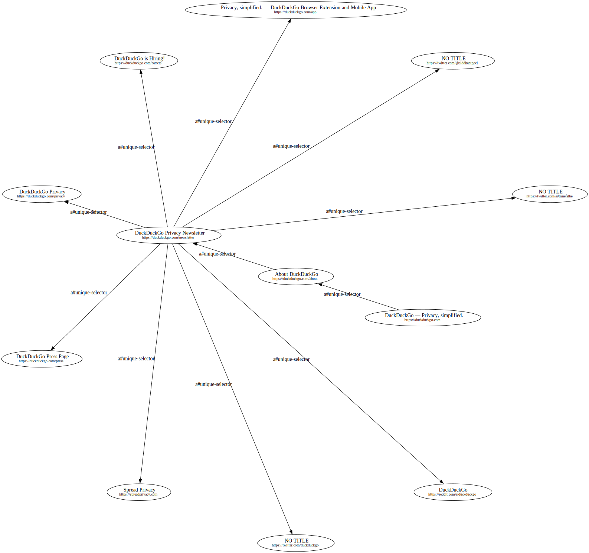

TODO write a decent readme

## Features (ideas)

- Generate interactive graph of the webpage sitemap where each node has:
  - Screenshot highlighting all the visible elements (button, a) that lead to another node
  - Page title. User can select this with a xpath or css selector or simply use the page title as default
  - Page download size. This only includes the single HTML page size 
  - Resources download size. This includes the page resources loaded asynchronously (js, images, css, fonts). User can filter and group these results
  - Edges connecting the nodes may include the most short xpath or css selector that can be used to click the element that will lead to the next node.

- Generate a summary (with recommendations) of the graph. Insights may include:
  - Page with the greatest/lowest download size
  - Page with the greatest/lowest number of incoming/outgoing edges
  - Embed recommendations from Google Lighthouse 
  - and so on...

- Analyze and provide SEO recommendations:
  - Auto-generate robots.txt

- Nice to have security recommendations. Embed web scanners and other security tools (e.g. dirb, nikto, xsspy)
This may be added mainly for convenience so that not-so-savvy users can use these tools without installing and configuring an environment or a tool.

V0.0-alpha output:



Generated with command

```shell
webtrav --url "https://duckduckgo.com" --max-depth 4 --output duckduckgo.svg
```